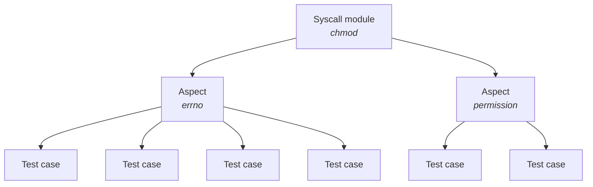

# pjdfstest - Rust rewrite

pjdfstest is a test suite that helps exercise POSIX system calls.

## Build

```bash
cd rust
cargo run
```

## Documentation

The documentation is available at [https://musikid.github.io/pjdfstest/](https://musikid.github.io/pjdfstest/).

## Architecture

The package is made of the tests, and a test runner to launch them.

### Tests (tests/)

To present how tests are organized, we take the `chmod` syscall as example.

There is a separate module for each syscall being tested.  Within each of those
modules, there may be either a single file, or a separate file for each aspect
of the syscall.

The hierarchy is like this:



### Layout

```tree
src/tests
├── chmod (syscall)
│   ├── errno.rs (aspect)
│   ├── mod.rs (syscall declaration)
│   └── permission.rs (aspect)
└── mod.rs (glues syscalls together)
```

#### tests/mod.rs

All the modules for the test groups should be declared in this file.

```rust
pub mod chmod;
```

### Syscall module

A syscall module contains test cases related to a specific syscall.
Its declaration should be in the `mod.rs` file 
of the relevant folder (`chmod/` in our case).
Common syscall-specific helpers can go here.

#### Aspect

An optional aspect module contains test cases that all relate to a common
aspect of the syscall.
Here "aspect" is a subjective area of related functionality.
The aspect module may be either:

- in a single file, which contains all the test functions and the case declaration,
- in a folder, which contains multiple modules for the test functions and a `mod.rs` file, in which the case is declared.

Though, except in the case of a very large set of test functions, it is better to write all in a single file.

#### Test case

Each test case exercises a minimal piece of the syscall's functionality.
Each must be registered with the `test_case!` macro.

For now, a test function takes a `&mut TestContext` parameter.

```rust,ignore
// chmod/00.t:L58
crate::test_case! {ctime => [FileType::Regular, FileType::Fifo, FileType::Block, FileType::Char, FileType::Socket]}
fn ctime(ctx: &mut TestContext, f_type: FileType) {
    let path = ctx.create(f_type).unwrap();
    let ctime_before = stat(&path).unwrap().st_ctime;

    sleep(Duration::from_secs(1));

    chmod(&path, Mode::from_bits_truncate(0o111)).unwrap();

    let ctime_after = stat(&path).unwrap().st_ctime;
    assert!(ctime_after > ctime_before);
}
```
