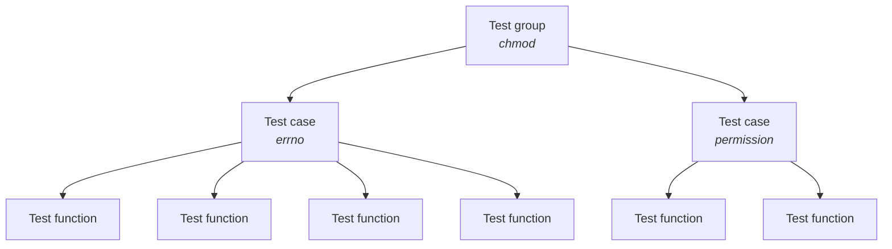

# pjdfstest - Rust rewrite

pjdfstest is a test suite that helps exercise POSIX system calls.

## Build

```bash
cd rust
cargo run
```

## Documentation

The documentation is available at [https://musikid.github.io/pjdfstest/](https://musikid.github.io/pjdfstest/).

## Architecture

The package is made of the tests, and a test runner to launch them.

### Tests (tests/)

To present how tests are organized, we take the `chmod` syscall as example.

For each syscall being tested, 
a test group which contains all the test cases 
related to this syscall should be created.

The hierarchy is like this:



### Layout

```tree
src/tests
├── chmod (syscall/test group)
│   ├── errno.rs (test case)
│   ├── mod.rs (test group declaration)
│   └── permission.rs (test case)
└── mod.rs (test groups modules declarations)
```

#### tests/mod.rs

All the modules for the test groups should be declared in this file.

```rust
pub mod chmod;
```

#### Test group

A test group contains test cases related to a specific syscall.
Its declaration should be in the `mod.rs` file 
of the relevant folder (`chmod/` in our case).

```rust
crate::pjdfs_group!(chmod; permission::test_case, errno::test_case);
```

#### Test case

A test case is made of test functions
related to a specific functionality.
All the test functions and the test case declaration 
should be grouped in a single module.
It means, either:

- in a single file, which contains all the test functions and the case declaration,
- in a folder, which contains multiple modules for the test functions and a `mod.rs` file, in which the case is declared.

Except in the case of a very large set of test functions, the first architecture should be privileged.

For example, in `chmod/permission.rs`, the test case declaration would be:

```rust
pjdfs_test_case!(permission, { test: test_ctime });
```

#### Test function

For now, a test function take a `&mut TestContext` parameter.

```rust,ignore
// chmod/00.t:L58
fn test_ctime(ctx: &mut TestContext) {
    for f_type in FileType::iter().filter(|ft| *ft != FileType::Symlink(None)) {
        let path = ctx.create(f_type).unwrap();
        let ctime_before = stat(&path).unwrap().st_ctime;

        sleep(Duration::from_secs(1));

        chmod(&path, Mode::from_bits_truncate(0o111)).unwrap();

        let ctime_after = stat(&path).unwrap().st_ctime;
        assert!(ctime_after > ctime_before);
    }
}
```
