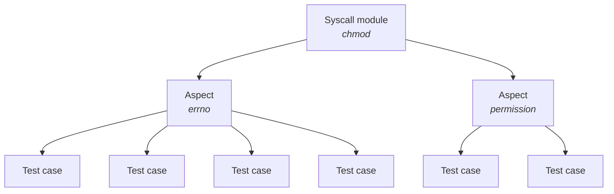

# Introduction

PJDFSTest is a file system test suite.
It was originally written to validate the ZFS port to FreeBSD,
but it now supports multiple operating systems and file systems.
This is a complete rewrite of the original test suite in Rust.

### NOTE: The documentation is still a work-in-progress.

## Build

```bash
cd rust
cargo run
```

### Run as root

```bash
cd rust
cargo build && sudo ./target/debug/pjdfs_runner
```

## Architecture

The package is made of the tests, and a test runner to launch them.

### Tests (tests/)

To present how tests are organized, we take the `chmod` syscall as example.

There is a separate module for each syscall being tested.  Within each of those
modules, there may be either a single file, or a separate file for each aspect
of the syscall.

The hierarchy is like this:



### Layout

```
src/tests
├── chmod (syscall)
│   ├── errno.rs (aspect)
│   ├── mod.rs (syscall declaration)
│   └── permission.rs (aspect)
└── mod.rs (glues syscalls together)
```

#### tests/mod.rs

All the modules for the test groups should be declared in this file.

```rust,ignore
pub mod chmod;
```

#### Syscall module

A syscall module contains test cases related to a specific syscall.
Its declaration should be in the `mod.rs` file 
of the relevant folder (`chmod/` in our case).
Common syscall-specific helpers can go here.

### Aspect

An optional aspect module contains test cases that all relate to a common
aspect of the syscall.
Here "aspect" is a subjective area of related functionality.
The aspect module may be either:

- in a single file, which contains all the test functions and the case declaration,
- in a folder, which contains multiple modules for the test functions and a `mod.rs` file, in which the case is declared.

Except in the case of a very large set of test functions, the first style
should be preferred.

#### Test case

Each test case exercises a minimal piece of the syscall's functionality.
Each must be registered with the `test_case!` macro.

- in a single file, which contains all the test functions and the case declaration,
- in a folder, which contains multiple modules for the test functions and a `mod.rs` file, which contains the declaration of the case.

Except in the case of a very large set of test functions, it is better to use a single file.

For example, in `chmod/permission.rs`, the test case declaration would be:

```rust,ignore
pjdfs_test_case!(permission, { test: test_ctime });
```

#### Test function

For now, a test function takes a `&mut TestContext` parameter.

```rust,ignore
// chmod/00.t:L58
crate::test_case!{ctime, Syscall::Chmod}
fn ctime(ctx: &mut TestContext) {
    for f_type in FileType::iter().filter(|ft| *ft != FileType::Symlink(None)) {
        let path = ctx.create(f_type).unwrap();
        let ctime_before = stat(&path).unwrap().st_ctime;

        sleep(Duration::from_secs(1));

        chmod(&path, Mode::from_bits_truncate(0o111)).unwrap();

        let ctime_after = stat(&path).unwrap().st_ctime;
        assert!(ctime_after > ctime_before);
    }
}
```

### Test runner (main.rs)

The test runner has to run the tests, and provide a command-line interface to allow the user to modify how the tests should be run.
It takes the tests from the specified test groups.

```rust,ignore
for group in [chmod::tests] {
```
