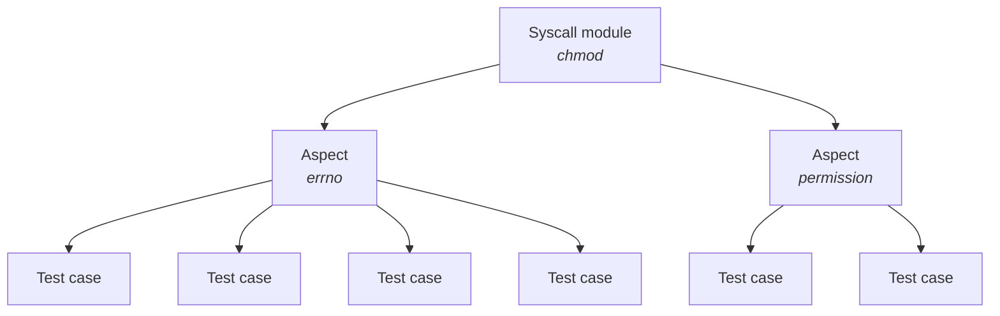

# Structure

The package is made of the tests, and a test runner to launch them.

## Tests (tests/)

To present how tests are organized, we take the `chmod` syscall as example.

There is a separate module for each syscall being tested. Within each of those
modules, there may be either a single file, or a separate file for each aspect
of the syscall.

The hierarchy is like this:



### Layout

```bash
src/tests
├── chmod (syscall)
│   ├── errno.rs (aspect)
│   └── permission.rs (aspect)
├── mod.rs (glues syscalls together)
└── chmod.rs (syscall declaration and simple test cases)
```

#### tests/mod.rs

All the modules for the test groups should be declared in this file.

```rust,ignore
pub mod chmod;
```

## Syscall module

A syscall module contains test cases related to a specific syscall.
Its declaration should be in the `<syscall_name>.rs` file at the root of the
`tests/` directory.
Common syscall-specific helpers can go here.

### Aspect

An optional aspect module contains test cases that all relate to a common
aspect of the syscall.
Here "aspect" is a subjective area of related functionality.
The aspect module may be either:

- in a single file, which contains all the test functions,
- in a folder, which contains multiple modules for the test functions, in which the case is declared.

Except in the case of a very large set of test functions, the first style
should be preferred.

### Test case

Each test case exercises a minimal piece of the syscall's functionality.
Each must be registered with the `test_case!` macro.

```rust,ignore
crate::test_case! {
    /// open do not update parent directory ctime and mtime fields if
    /// the file previously existed.
    exists_no_update
}
fn exists_no_update(ctx: &mut TestContext) {
    let file = ctx.create(FileType::Regular).unwrap();

    assert_times_unchanged()
        .path(ctx.base_path(), CTIME | MTIME)
        .execute(ctx, false, || {
            assert!(open_wrapper(&file, Mode::from_bits_truncate(0o755)).is_ok());
        });
}
```

## Test runner (main.rs)

The test runner has to run the tests, and provide a command-line interface to allow the user to modify how the tests should be run.
It takes the tests from the specified test groups.
